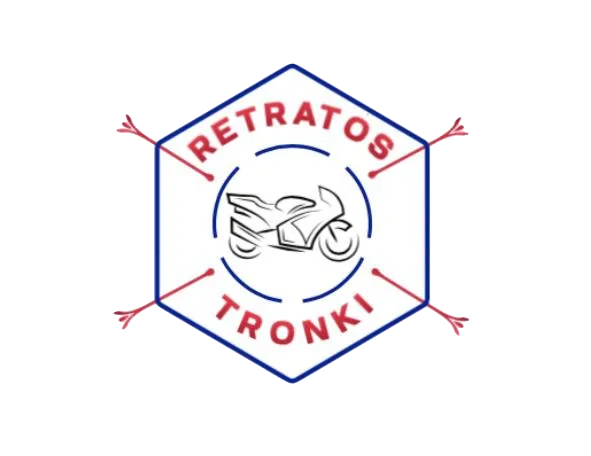
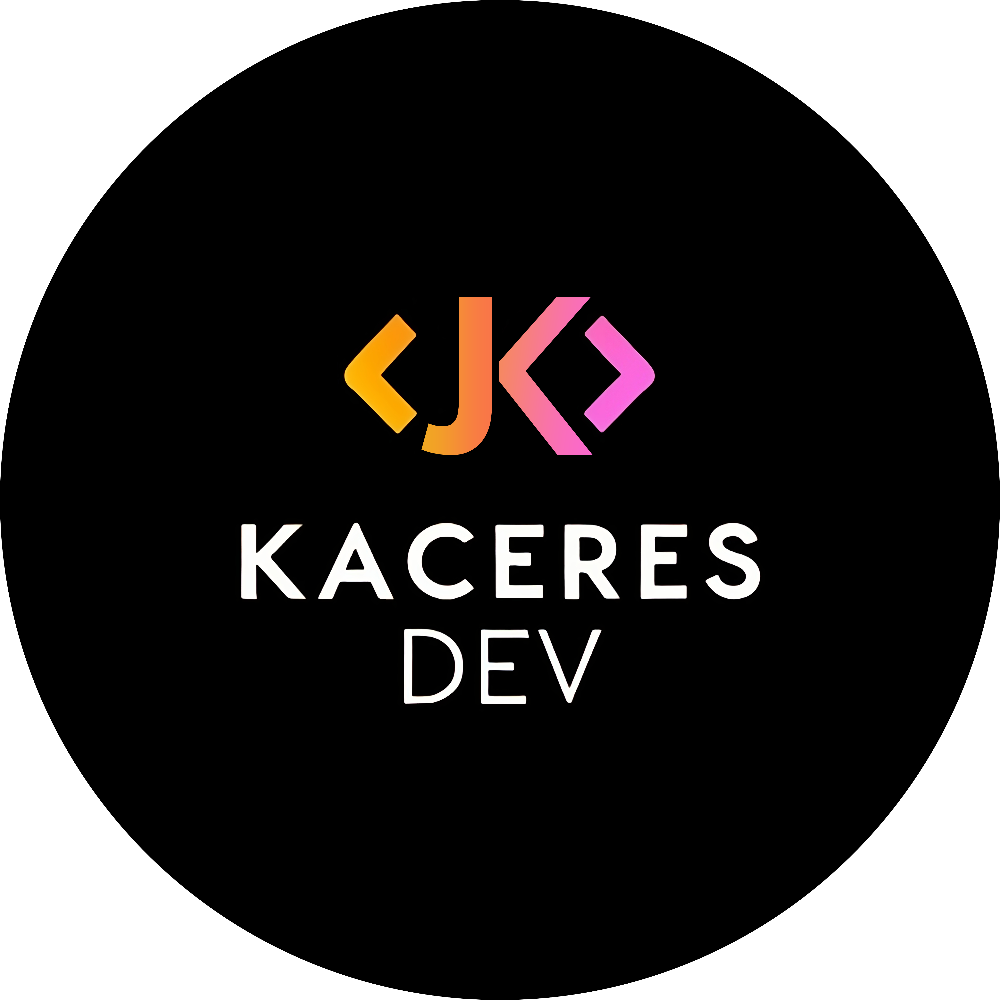
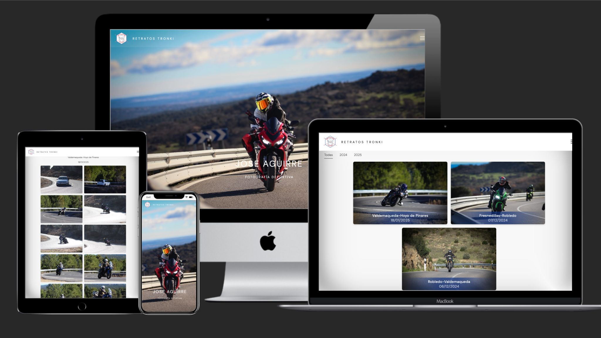

# Retratostronki

Este proyecto es utilizado para mostrar las fotografías realizadas por un profesional de la fotografía del motorsport. Buscando la facilidad del profesional, se reutiliza la forma en que guardaba las imágenes en Google Drive para, a através de su API, poder obtenerlas y exponerlas en la aplicación. Con este proyecto, se buscaba dar mayor exposición a su trabajo artístico.

## App

➡️ https://retratostronki.es/

## Screenshots

## Tech Stack

**Client:** Angular 17

**Server:** Node, Express

**Integrations:** Google Drive, Nodemailer, Google Analytics

**Hosting:** Firebase

## 🔗 Links

